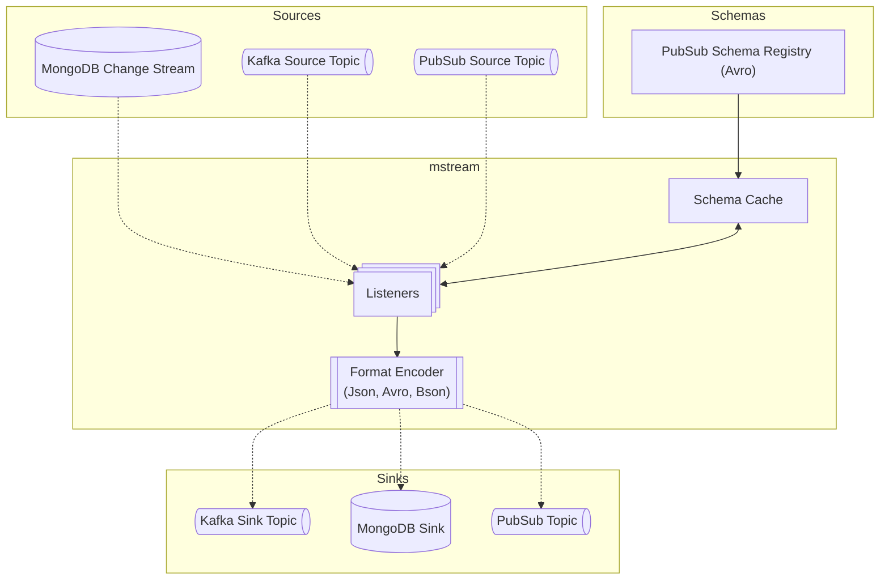

mstream
===

The application subscribes to [mongodb change streams](https://www.mongodb.com/docs/manual/changeStreams/) and Kafka topics specified in config.
MongoDB create and update events, as well as messages from Kafka, are picked up and can be encoded in various formats (Avro, JSON, BSON) before being sent to GCP PubSub, Kafka, or MongoDB.
One connector can be configured to consume from **one source** and publish to **multiple sink topics** from various providers.

`Minimum tested MongoDB version: 6.0`



### Supported Format Conversions

mstream supports multiple encoding formats for both sources and sinks:

#### BSON Source

- BSON → Avro: Converts MongoDB BSON documents to Avro records
- BSON → JSON: Serializes BSON documents to JSON format
- BSON → BSON: Direct passthrough (for MongoDB to MongoDB replication)

#### Avro Source

- Avro → Avro: Passthrough, no schema validation
- Avro → JSON: Deserializes Avro records to JSON format
- Avro → BSON: Converts Avro records to MongoDB BSON documents

#### JSON Source

- JSON → JSON: Passthrough
- JSON → Avro: Parses JSON and encodes as Avro records
- JSON → BSON: Parses JSON and converts to BSON documents

JSON source operations are processed by first converting to BSON internally and then
applying the same transformation logic as BSON sources, unless the target is JSON.

### Schema Filtering (Optional)

A schema can optionally be used as a mask to filter out unwanted fields from the source document, allowing you to selectively extract only the data you need. If no schema is specified, all fields from the source document will be passed through to the sink.

#### How Schema Filtering Works

When a schema is applied to a source document, only fields defined in the schema will be included in the resulting document. Any fields in the source document that aren't specified in the schema will be excluded.

#### Example

**Schema definition:**
```json
{
  "type": "record",
  "name": "User",
  "fields": [
    { "name": "name", "type": "string" }
  ]
}
```

**Source document:**
```json
{
  "name": "John",
  "age": 30,
  "last_name": "Doe"
}
```

**Result after filtering:**
```json
{
  "name": "John"
}
```

In this example, only the "name" field was included in the result because it was the only field defined in the schema. The "age" and "last_name" fields were filtered out.

#### Connector Configuration

In your connector configuration, the `schema` field is optional:

1. **With schema filtering:**
   ```toml
   [[connectors]]
   name = "filtered-connector"
   source = { service_name = "mongodb-source", id = "users", encoding = "bson" }
   schema = { service_name = "pubsub-example", id = "projects/your-project/schemas/user-schema", encoding = "avro" }
   sinks = [
       { service_name = "kafka-local", id = "filtered_users", encoding = "json" }
   ]
   ```

2. **Without schema filtering (all fields pass through):**
   ```toml
   [[connectors]]
   name = "unfiltered-connector"
   source = { service_name = "mongodb-source", id = "users", encoding = "bson" }
   # No schema defined - all fields will be passed through
   sinks = [
       { service_name = "kafka-local", id = "all_user_data", encoding = "json" }
   ]
   ```

### Mongo Event Processing

**Supported Sources**
* [MongoDB Change Stream Events](https://www.mongodb.com/docs/v6.0/reference/change-events/)
  * Insert document
  * Update document
  * Delete document
* Kafka Messages

**The worker will report an error and stop execution for MongoDB events**
* Invalidate stream
* Drop collection
* Drop database

#### Message Structure

A processed change stream is transformed into a pubsub message with the following structure:

**[Attributes](https://cloud.google.com/pubsub/docs/publisher#using-attributes)**

attribute name | attribute value
---------------| ----------------
operation_type | event type: `insert`, `update`, `delete`
database       | mongodb database name
collection     | mongodb collection name

Attributes can be used to configure fine-grained subscriptions. For more details see [documentation](https://cloud.google.com/pubsub/docs/subscription-message-filter#filtering_syntax)

**Payload**

Payload represents a mongo db document encoded in avro format

### Running

```sh
# Spawn mongo cluster in docker
$ make db-up
$ make db-check

# This will run the app with 'cargo run' and debug log level
$ make run-debug
```

### Testing

**Unit tests**

```sh
$ make unit-tests
```

**Integration tests** _(to be run locally)_

Install [gcloud](https://cloud.google.com/sdk/docs/install) - google access token will be retrieved through gcloud cli tool, unlike production case scenario where the application relies on service account configuration.

In order to run integration tests, it is required to have locally spawned mongodb cluster
and a configured GCP pubsub topic, schema and subscription.

It is planned to automate creating GCP resources in the future. For now check `tests/setup/mod.rs`

```sh
$ make integration-tests
```

### Configuring Docker Mongo Cluster
https://www.mongodb.com/compatibility/deploying-a-mongodb-cluster-with-docker

## License

License under either or:

* [MIT](LICENSE-MIT)
* [Apache License, Version 2.0](LICENSE-APACHE)
