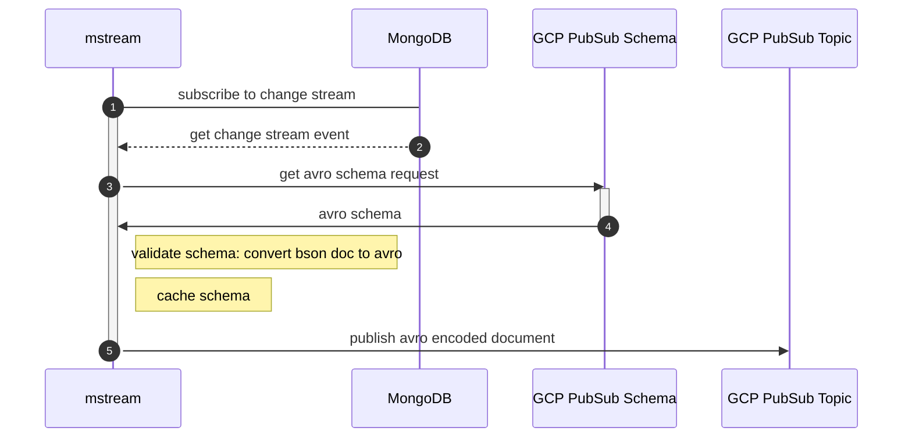

mstream
===

The application subscribes to [mongodb change streams](https://www.mongodb.com/docs/manual/changeStreams/) for collections specified in config.
Create and update events are picked up and sent as avro binary-encoded entities to respective GCP PubSub Topics.



#### Running

Install [gcloud](https://cloud.google.com/sdk/docs/install)

```sh
# Spawn mongo cluster in docker
$ make db-up
$ make db-check

# Listen to db events and publish to pubsub
$ make setup-config
$ source .env
$ make run-listen
```

#### Testing

**Unit tests**

```sh
$ make unit-tests
```

**Integration tests** _(to be run locally)_

In order to run integration tests, it is required to have locally spawned mongodb cluster
and a configured GCP pubsub topic, schema and subscription.

It is planned to automate creating GCP resources in the future. For now check `tests/setup/mod.rs`

```sh
$ make integration-tests
```

#### Configuring Docker Mongo Cluster
https://www.mongodb.com/compatibility/deploying-a-mongodb-cluster-with-docker

## License

License under either or:

* [MIT](LICENSE-MIT)
* [Apache License, Version 2.0](LICENSE-APACHE)
