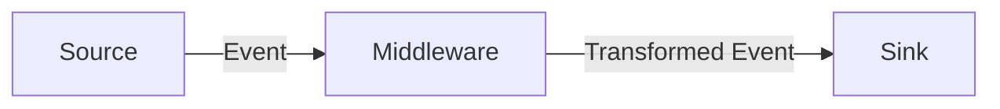

# mstream

[](https://codescene.io/projects/45886)

A lightweight, high-performance data streaming bridge that connects sources to sinks with powerful transformation capabilities.

**mstream** simplifies building data pipelines by providing a configurable bridge between systems like MongoDB, Kafka, and PubSub. It handles format conversion, schema validation, and data transformation out of the box.

## Web UI

Access the dashboard at `http://localhost:8719/`.


- **Dashboard** — Overview of all jobs and services
- **Job Management** — Create, stop, and restart jobs
- **Service Management** — View and manage service configurations
- **Pipeline Visualization** — Visual representation of data flow

## Features

- **Universal Connectivity** — Stream data between MongoDB, Kafka, and Google Cloud PubSub
- **Zero-Code Transformations** — Convert between BSON, JSON, and Avro formats automatically
- **Powerful Middleware** — Transform data in-flight using HTTP services or embedded Rhai scripts
- **Schema Validation** — Enforce data quality with Avro schema validation
- **Schema Introspection** — Discover collection schemas without exposing sensitive data
- **Batch Processing** — Optimized high-throughput batch handling
- **Checkpoint Persistence** — Resume streaming from the last processed position after restarts

## Installation

### Using Docker (recommended)

```bash
cp mstream-config.toml.example mstream-config.toml
# edit config as needed
make docker-up
```

### Building from Source

```bash
cargo build --release
RUST_LOG=info ./target/release/mstream
```

## Quick Start

Create a `mstream-config.toml` file:

```toml
[[services]]
provider = "mongodb"
name = "mongo-local"
connection_string = "mongodb://localhost:27017"
db_name = "app_db"
write_mode = "insert"  # optional: "insert" (default) or "replace"

[[services]]
provider = "kafka"
name = "kafka-local"
"bootstrap.servers" = "localhost:9092"

[[connectors]]
enabled = true
name = "users-sync"
source = { service_name = "mongo-local", resource = "users", output_encoding = "json" }
sinks = [
    { service_name = "kafka-local", resource = "users-topic", output_encoding = "json" }
]
```

Run mstream:

```bash
RUST_LOG=info ./mstream
```

### Examples

- [mongo_to_kafka.toml](examples/mongo_to_kafka.toml) — MongoDB Change Stream → Kafka
- [kafka_to_mongo.toml](examples/kafka_to_mongo.toml) — Kafka → MongoDB
- [rhai/](examples/rhai) — Rhai transformation scripts (includes [append-only MongoDB pattern](examples/rhai/README.md#append-only-mongodb-sink))

## Core Concepts



- **Source** — Origin of data (MongoDB Change Stream, Kafka topic, PubSub subscription)
- **Middleware** — Optional transformation step (HTTP service or Rhai script)
- **Sink** — Destination for data (Kafka topic, MongoDB collection, PubSub topic, HTTP endpoint)

## Supported Integrations

| Type | Service | Notes |
|------|---------|-------|
| **Source** | MongoDB | Change Streams (v6.0+) |
| **Source** | Kafka | Consumer groups, offset management |
| **Source** | Google PubSub | Subscriptions |
| **Sink** | MongoDB | Insert or Replace (upsert by `_id`) |
| **Sink** | Kafka | Producer |
| **Sink** | Google PubSub | Publisher |
| **Sink** | HTTP | POST requests |

## Environment Variables

| Variable | Description | Default |
|----------|-------------|---------|
| `MSTREAM_API_PORT` | Port for the REST API and Web UI | `8719` |
| `MSTREAM_ENC_KEY` | Hex-encoded AES-256 key for service encryption | — |
| `RUST_LOG` | Log level (`error`, `warn`, `info`, `debug`, `trace`) | `info` |

## Logs Configuration

Configure the in-memory log buffer for the Logs API:

```toml
[system.logs]
buffer_capacity = 10000       # Max entries in ring buffer (default: 10000)
stream_preload_count = 100    # Entries sent on SSE connect (default: 100)
```

## Management API

REST API available at port `8719` (configurable via `MSTREAM_API_PORT`).

### Monitoring

| Method | Endpoint | Description |
|--------|----------|-------------|
| `GET` | `/health` | System health, version, and uptime |
| `GET` | `/stats` | Aggregate metrics across all running jobs |
| `GET` | `/jobs/{name}/metrics` | Live per-job metrics |

#### Health

```
GET /health
```

```json
{
  "status": "healthy",
  "version": "0.45.0",
  "uptime_seconds": 3600
}
```

Status is `"healthy"` when no jobs have failed, `"degraded"` when any job has failed. Stopped jobs do not affect health status.

#### Stats

```
GET /stats
```

```json
{
  "total_events_processed": 15000,
  "total_bytes_processed": 4820000,
  "uptime_seconds": 3600,
  "running_jobs": 3,
  "stopped_jobs": 1,
  "error_jobs": 0
}
```

Event and byte counters are aggregated across all running jobs using lock-free atomic counters. Batch jobs count individual documents, not batches.

#### Job Metrics

```
GET /jobs/{name}/metrics
```

```json
{
  "events_processed": 5000,
  "bytes_processed": 1200000,
  "current_lag_seconds": 2.5,
  "throughput_per_second": 150.7,
  "total_errors": 3,
  "last_processed_at": "2025-01-15T10:30:00Z"
}
```

`current_lag_seconds` is computed at read time as `now - last_source_timestamp` (in seconds). The source timestamp is extracted from each source adapter: MongoDB CDC `wall_time`/`cluster_time`, Kafka message timestamp, or PubSub `publish_time`. Returns `0.0` when no source timestamp is available yet. A growing lag indicates the pipeline is falling behind the source ingestion rate.

`last_processed_at` is `null` when no events have been processed yet. Returns zeroed metrics if the job exists but has no counter (e.g. stopped jobs). Returns `404` if the job is not found.

### Jobs

| Method | Endpoint | Description |
|--------|----------|-------------|
| `GET` | `/jobs` | List all jobs |
| `POST` | `/jobs` | Create a new job |
| `POST` | `/jobs/{name}/stop` | Stop a job |
| `POST` | `/jobs/{name}/restart` | Restart a job |
| `GET` | `/jobs/{name}/checkpoints` | List checkpoint history for a job |
| `GET` | `/jobs/{name}/metrics` | Live metrics for a running job |

### Services

| Method | Endpoint | Description |
|--------|----------|-------------|
| `GET` | `/services` | List all services |
| `POST` | `/services` | Create a new service |
| `GET` | `/services/{name}` | Get service details |
| `DELETE` | `/services/{name}` | Remove a service (if not in use) |
| `GET` | `/services/{name}/resources` | List resources for a service |
| `GET` | `/services/{name}/resources/{resource}` | Get resource content (e.g. UDF script) |
| `GET` | `/services/{name}/schema/introspect` | Introspect schema for a resource |
| `GET` | `/services/{name}/schemas` | List schemas stored on this service |
| `GET` | `/services/{name}/schemas/{id}` | Get a schema by ID |
| `POST` | `/services/{name}/schemas` | Save a schema to this service |
| `DELETE` | `/services/{name}/schemas/{id}` | Delete a schema |
| `POST` | `/schema/fill` | Generate synthetic data from a schema |
| `POST` | `/schema/convert` | Convert schema between JSON Schema and Avro |

#### List Service Resources

List available resources (collections, scripts, topics) for a service:

```
GET /services/{name}/resources
```

**Response (MongoDB):**
```json
{
  "service_name": "mongo-local",
  "resources": [
    { "name": "users", "resource_type": "collection" },
    { "name": "orders", "resource_type": "collection" }
  ]
}
```

**Response (UDF):**
```json
{
  "service_name": "my-udf",
  "resources": [
    { "name": "transform.rhai", "resource_type": "script" },
    { "name": "mask.rhai", "resource_type": "script" }
  ]
}
```

Supported providers:
- **MongoDB** — lists collections (excludes `system.*` prefixed collections)
- **UDF** — lists script filenames from `sources` config or from the `script_path` directory

#### Get Resource Content

Fetch the content of a specific resource (currently supports UDF script content):

```
GET /services/{name}/resources/{resource}
```

**Response:**
```json
{
  "content": "fn transform(data, attributes) {\n  result(data, attributes)\n}"
}
```

Returns `404` if the resource is not found, `400` if the service provider does not support content retrieval.

#### Schema Introspection

Introspect the schema of a MongoDB collection by sampling documents:

```
GET /services/{name}/schema?resource=users&sample_size=100
```

| Parameter | Description | Default |
|-----------|-------------|---------|
| `resource` | Collection name to introspect (required) | — |
| `sample_size` | Number of documents to sample (max: 1000) | 100 |

**Response:** Returns schema variants grouped by document shape. Documents with conflicting field types are grouped separately.

```json
[
  {
    "share_percent": 95.0,
    "sample_count": 95,
    "schema": {
      "type": "object",
      "properties": {
        "name": { "type": "string" },
        "age": { "type": "integer" },
        "email": { "type": "string" }
      },
      "required": ["name", "age"]
    }
  }
]
```

> **Note:** Schema introspection samples documents without exposing actual values, making it safe for compliance-sensitive environments where you need to build transformation pipelines without viewing PII.

#### Schema Fill

Generate synthetic data from a JSON Schema via `POST /schema/fill`. Pass `{"schema": <JsonSchema>}` and receive a document with realistic values based on schema hints (`enum`, `format`, `minimum`/`maximum`) and field name heuristics (e.g., `email` → email address, `_id` → ObjectId, `created_at` → datetime).

Useful for testing transformation scripts in the Playground without exposing real data.

#### Schema Convert

Convert schemas bidirectionally between JSON Schema and Avro via `POST /schema/convert`. For JSON→Avro, provide optional `name` and `namespace` in the options.

See [design/playground-schema-integration.md](design/playground-schema-integration.md) for detailed type mappings.

### Logs

| Method | Endpoint | Description |
|--------|----------|-------------|
| `GET` | `/logs` | Query log entries with optional filters |
| `GET` | `/logs/stream` | SSE stream of live log entries |

#### Query Parameters for `/logs`

| Parameter | Description |
|-----------|-------------|
| `job_name` | Filter by job name |
| `level` | Minimum log level (`trace`, `debug`, `info`, `warn`, `error`) |
| `limit` | Maximum number of entries to return (default: 100) |
| `since` | Only entries after this timestamp (RFC3339 format) |

#### Query Parameters for `/logs/stream`

| Parameter | Description |
|-----------|-------------|
| `job_name` | Filter by job name |
| `level` | Minimum log level |
| `initial` | Number of historical entries to send initially (default: 100) |

### Transform (Playground)

| Method | Endpoint | Description |
|--------|----------|-------------|
| `POST` | `/transform/run` | Test a Rhai script on a sample document |
| `POST` | `/transform/test/generate` | Generate test cases from a sample input |
| `POST` | `/transform/test/run` | Run test cases against a script |

#### Request Body

```json
{
  "script": "fn transform(data, attributes) { result(data, attributes) }",
  "payload": "{\"email\": \"john@example.com\"}",
  "attributes": {"source": "playground"}
}
```

- `script` — Rhai script with `transform(data, attributes)` function (required)
- `payload` — JSON string of the input document or array (required)
- `attributes` — Optional key-value metadata passed to the script

> **Note:** For batch processing, pass a JSON array as the payload (e.g., `"[{...}, {...}]"`). The script receives the array directly and can iterate over it.

#### Response

```json
{
  "message": "success",
  "item": {
    "document": {"email": "j***@example.com"},
    "attributes": {"source": "playground", "processed": "true"}
  }
}
```

#### Test Generation

Generate test cases by introspecting a sample input and creating edge-case variants (nulls, empty values, missing fields).

**Request:**
```json
{
  "script": "fn transform(data, attributes) { result(data, attributes) }",
  "sample_input": {"email": "john@example.com", "name": "John", "age": 30}
}
```

**Response:**
```json
{
  "input_schema": {
    "type": "object",
    "properties": {
      "email": {"type": "string"},
      "name": {"type": "string"},
      "age": {"type": "integer"}
    }
  },
  "cases": [
    {
      "name": "email is null",
      "input": {"email": null, "name": "John", "age": 30},
      "expected": {"email": null, "name": "John", "age": 30},
      "assertions": [
        {"path": "email", "assert_type": "equals", "expected_value": null}
      ],
      "duration_ms": 5
    }
  ],
  "errors": []
}
```

#### Test Execution

Run test cases against a script and return pass/fail results with assertion failures.

**Request:**
```json
{
  "script": "fn transform(data, attributes) { result(data, attributes) }",
  "cases": [
    {
      "name": "basic test",
      "input": {"email": "john@example.com"},
      "expected": {"email": "j***@example.com"},
      "assertions": [
        {"path": "email", "assert_type": "equals", "expected_value": "j***@example.com"}
      ]
    }
  ],
  "strict_output": false
}
```

- `strict_output` — When `true`, fails if output contains fields not covered by assertions

**Response:**
```json
{
  "summary": {"passed": 1, "failed": 1, "total": 2},
  "results": [
    {"name": "basic test", "passed": true, "duration_ms": 12},
    {
      "name": "null email",
      "passed": false,
      "duration_ms": 8,
      "actual": {"email": "***"},
      "failures": [
        {
          "path": "email",
          "assert_type": "equals",
          "expected": null,
          "actual": "***",
          "message": "Field 'email': expected null, got \"***\""
        }
      ]
    }
  ]
}
```

**Assertion Types:**

| Type | Description |
|------|-------------|
| `equals` | Strict equality |
| `contains` | Substring match (strings) or element exists (arrays) |
| `type_matches` | Only checks type, not value |
| `gt`, `gte`, `lt`, `lte` | Numeric comparisons |

### Schemas

Schemas are accessed through the service that stores them. MongoDB services persist schemas in a collection; PubSub services interact with the GCP Schema Registry.

| Method | Endpoint | Description |
|--------|----------|-------------|
| `GET` | `/services/{name}/schemas` | List all schemas on a service |
| `GET` | `/services/{name}/schemas/{id}` | Get a single schema |
| `POST` | `/services/{name}/schemas` | Create or update a schema |
| `DELETE` | `/services/{name}/schemas/{id}` | Delete a schema |

#### Save Schema

```
POST /services/system-db/schemas
```

```json
{
  "name": "user-schema",
  "encoding": "avro",
  "definition": "{\"type\":\"record\",\"name\":\"User\",\"fields\":[{\"name\":\"email\",\"type\":\"string\"}]}"
}
```

For MongoDB services, the `id` field is auto-assigned if omitted. For PubSub services, the `name` field is used as the schema ID in GCP.

> **Note:** Saving to a remote service (e.g. PubSub) that already has a schema with the same name will fail with a conflict. A future update will add a confirmation guardrail for remote overwrites.

### Test Suites

| Method | Endpoint | Description |
|--------|----------|-------------|
| `GET` | `/test-suites` | List saved test suites |
| `GET` | `/test-suites/{id}` | Get a test suite by ID |
| `POST` | `/test-suites` | Save a test suite |
| `DELETE` | `/test-suites/{id}` | Delete a test suite |

Test suites persist test cases, assertions, and optionally a reference to the transform script they were authored against. Used by the Transform Studio to save and reload testing sessions.

## Checkpoints

Checkpoints allow connectors to resume from their last processed position after a restart, preventing data loss or reprocessing.

### System Configuration

Enable checkpoints globally by configuring a MongoDB backend:

```toml
[system.checkpoints]
service_name = "mongo-local"  # Must reference an existing MongoDB service
resource = "mstream-checkpoints"  # Collection to store checkpoint data
```

### Connector Configuration

Enable checkpointing per connector:

```toml
[[connectors]]
name = "users-sync"
checkpoint = { enabled = true }
source = { service_name = "mongo-local", resource = "users", output_encoding = "json" }
sinks = [
    { service_name = "kafka-local", resource = "users-topic", output_encoding = "json" }
]
```

### Supported Sources

| Source | Checkpoint Data | Notes |
|--------|-----------------|-------|
| MongoDB Change Stream | Resume token | Automatic resume on restart |
| Kafka | Topic, partition, offset | `offset_seek_back_seconds` takes priority over checkpoint when set |
| Google PubSub | — | Not yet supported |

### Behavior

- When a connector restarts with checkpoints enabled, it resumes from the last saved position
- For Kafka: if `offset_seek_back_seconds` is configured, it takes priority over the checkpoint (useful for reprocessing historical data)
- Checkpoints are saved after all sinks successfully process each event

## Documentation

- [Persistence](docs/persistence.md) — Job and service persistence configuration
- [Technical Reference](docs/reference.md) — Encoding, schemas, batch processing, middleware

## Development

```bash
make docker-db-up    # Start MongoDB cluster
make run-debug       # Run with debug logging
make unit-tests      # Run unit tests
make integration-tests  # Run integration tests
```

## License

MIT License — see [LICENSE](LICENSE) for details.
