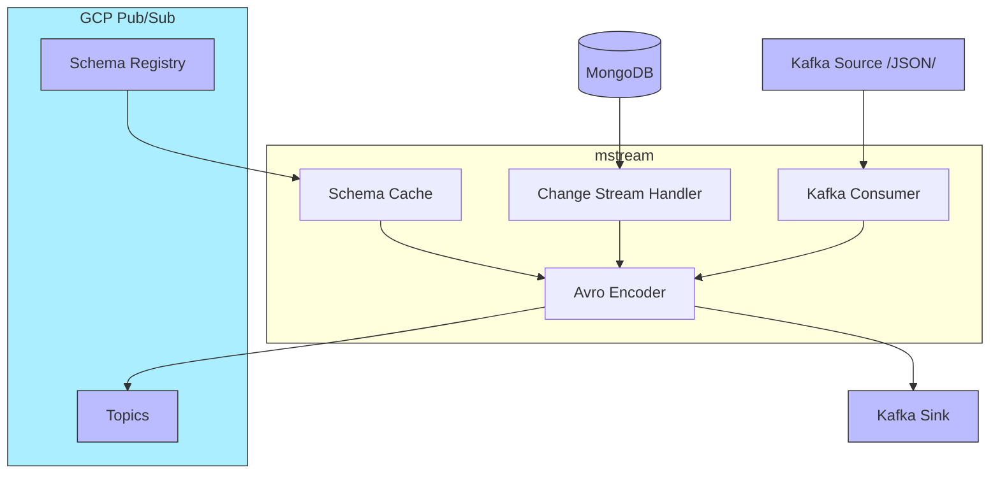

mstream
===

The application subscribes to [mongodb change streams](https://www.mongodb.com/docs/manual/changeStreams/) and Kafka topics specified in config.
MongoDB create and update events, as well as **JSON encoded** Kafka messages, are picked up and sent as avro binary-encoded entities to GCP PubSub and/or Kafka.
One connector can be configured to consume from **one source** and publish to **multiple sink topics** from various providers.

`Minimum tested MongoDB version: 6.0`



### Event Processing

**Supported Sources**
* [MongoDB Change Stream Events](https://www.mongodb.com/docs/v6.0/reference/change-events/)
  * Insert document
  * Update document
  * Delete document
* Kafka Messages

**The worker will report an error and stop execution for MongoDB events**
* Invalidate stream
* Drop collection
* Drop database

#### Message Structure

A processed change stream is transformed into a pubsub message with the following structure:

**[Attributes](https://cloud.google.com/pubsub/docs/publisher#using-attributes)**

attribute name | attribute value
---------------| ----------------
stream_name    | connector name provided in config
operation_type | event type: `insert`, `update`, `delete`
database       | mongodb database name
collection     | mongodb collection name

Attributes can be used to configure fine-grained subscriptions. For more details see [documentation](https://cloud.google.com/pubsub/docs/subscription-message-filter#filtering_syntax)

**Payload**

Payload represents a mongo db document encoded in avro format

### Running

```sh
# Spawn mongo cluster in docker
$ make db-up
$ make db-check

# This will run the app with 'cargo run' and debug log level
$ make run-debug
```

### Testing

**Unit tests**

```sh
$ make unit-tests
```

**Integration tests** _(to be run locally)_

Install [gcloud](https://cloud.google.com/sdk/docs/install) - google access token will be retrieved through gcloud cli tool, unlike production case scenario where the application relies on service account configuration.

In order to run integration tests, it is required to have locally spawned mongodb cluster
and a configured GCP pubsub topic, schema and subscription.

It is planned to automate creating GCP resources in the future. For now check `tests/setup/mod.rs`

```sh
$ make integration-tests
```

### Configuring Docker Mongo Cluster
https://www.mongodb.com/compatibility/deploying-a-mongodb-cluster-with-docker

## License

License under either or:

* [MIT](LICENSE-MIT)
* [Apache License, Version 2.0](LICENSE-APACHE)
