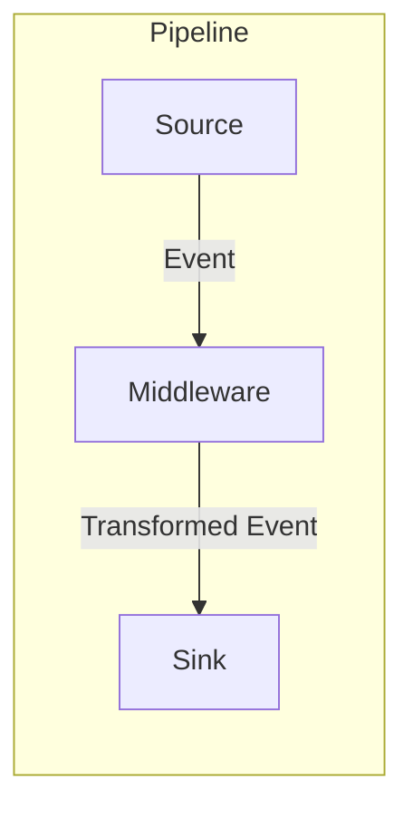

# mstream

A lightweight, high-performance data streaming bridge that connects sources to sinks with powerful transformation capabilities.

**mstream** simplifies building data pipelines by providing a configurable bridge between systems like MongoDB, Kafka, and PubSub. It handles format conversion, schema validation, and data transformation out of the box, allowing you to focus on your data logic rather than glue code.

## 🚀 Features

- **Universal Connectivity**: Stream data between MongoDB, Kafka, and Google Cloud PubSub.
- **Zero-Code Transformations**: Convert between BSON, JSON, and Avro formats automatically.
- **Powerful Middleware**: Transform data in-flight using HTTP services or embedded Rhai scripts.
- **Schema Validation**: Enforce data quality with Avro schema validation and filtering.
- **High Performance**: Optimized batch processing with zero-copy BSON handling for MongoDB.
- **Simple Configuration**: Define your entire pipeline in a single TOML file.

## 📦 Installation

###  Get Help

```base
make
```

### Using Docker

1. Create a configuration file:
   ```bash
   cp mstream-config.toml.example mstream-config.toml
   ```

2. Start the full stack using the Makefile helper:
   ```bash
   make docker-up
   ```

### Building from Source

```bash
cargo build --release
```

## 🔧 Quick Start

Create a `mstream-config.toml` file to define your pipeline. Here is a simple example that streams changes from a MongoDB collection to a Kafka topic:

```toml
# 1. Define Services
[[services]]
provider = "mongodb"
name = "mongo-local"
connection_string = "mongodb://localhost:27017"
db_name = "app_db"

[[services]]
provider = "kafka"
name = "kafka-local"
"bootstrap.servers" = "localhost:9092"

# 2. Define Connector
[[connectors]]
enabled = true
name = "users-sync"

# Source: Watch 'users' collection
source = { service_name = "mongo-local", resource = "users", output_encoding = "json" }

# Sink: Publish to 'users-topic'
sinks = [
    { service_name = "kafka-local", resource = "users-topic", output_encoding = "json" }
]
```

Run mstream with your configuration:

```bash
# Run binary
RUST_LOG=info ./mstream

# Or run with Docker Compose (recommended)
docker-compose up --build
```

## 📚 Core Concepts

### Components



- **Source**: The origin of data (e.g., a MongoDB Change Stream, Kafka topic).
- **Sink**: The destination for data (e.g., a Kafka topic, HTTP endpoint).
- **Middleware**: Optional processing steps that sit between source and sink to transform, enrich, or filter data.

### Schema and Encoding

mstream uses a clear input/output encoding model:

- **Input Encoding**: The format data is received in (e.g., `avro` from Kafka).
- **Output Encoding**: The format data is transformed to before the next step (e.g., `json` for a sink).

```toml
[[connectors]]
# Read Avro from Kafka -> Convert to JSON -> Write to MongoDB as BSON
source = { service_name = "kafka", resource = "events", input_encoding = "avro", output_encoding = "json" }
sinks = [
    { service_name = "mongo", resource = "events_archive", output_encoding = "bson" }
]
```

### Batch Processing

For high-throughput scenarios, enable batch processing to group events:

```toml
[[connectors]]
name = "high-volume-sync"
batch = { kind = "count", size = 100 }
source = { service_name = "mongo", resource = "logs", output_encoding = "bson" }
sinks = [
    { service_name = "kafka", resource = "logs-batch", output_encoding = "json" }
]
```

**Important Considerations:**
- **MongoDB Optimizations**: Batch processing is heavily optimized for MongoDB using framed BSON structures. This enables zero-copy processing but restricts the inner item encoding to `bson`.
- **Encoding Compatibility**: Due to internal optimizations, mixing incompatible output encodings for different sinks (e.g., `bson` vs `json`) is not supported in batch mode. All sinks must accept the optimized batch format.
- **Sink Limitations**: The framed content format used for optimized batches is not supported by PubSub or Kafka sinks.
- **Middleware**: Middleware services must be capable of handling batched data (arrays) in the format provided.
- **Schema Validation**: Schema validation is applied to each event in the batch individually before passing to middleware.
- **Resource Usage**: The batch size directly affects memory usage and should be tuned based on available resources.
- **Latency**: For time-sensitive events, lower batch sizes may be preferable to reduce latency.

### Middleware Support

Transform data on the fly using HTTP services or embedded scripts.

#### HTTP Middleware
Send events to an external API for processing:

```toml
middlewares = [
    { service_name = "my-api", resource = "enrich-user", output_encoding = "json" }
]
```

#### UDF (Rhai) Middleware
Write custom transformation logic in [Rhai](https://rhai.rs) scripts for high-performance, safe execution:

```toml
[[services]]
provider = "udf"
name = "script-engine"
engine = { kind = "rhai" }
script_path = "./scripts"

[[connectors]]
middlewares = [
    { service_name = "script-engine", resource = "anonymize.rhai", output_encoding = "json" }
]
```

**Example Script (`anonymize.rhai`):**
```rhai
fn transform(data, attributes) {
    // Mask email address
    if "email" in data {
        data.email = mask_email(data.email);
    }
    
    // Add timestamp
    data.processed_at = timestamp_ms();
    
    result(data, attributes)
}
```

## Supported Integrations

| Type | Service | Notes |
|------|---------|-------|
| **Source** | MongoDB | Change Streams (v6.0+) |
| **Source** | Kafka | Consumer groups, offset management |
| **Source** | Google PubSub | Subscriptions |
| **Sink** | MongoDB | Insert/Update/Delete operations |
| **Sink** | Kafka | Producer |
| **Sink** | Google PubSub | Publisher |
| **Sink** | HTTP | POST requests |

## Technical Reference

### PubSub Message Structure

When using Google Cloud PubSub as a sink, mstream adds the following attributes to the message:

| Attribute | Description |
|-----------|-------------|
| `operation_type` | Event type: `insert`, `update`, `delete` |
| `database` | MongoDB database name (for Mongo sources) |
| `collection` | MongoDB collection name (for Mongo sources) |

### MongoDB Batch Format

When batch processing is enabled for a MongoDB sink, events are stored as a single document with an `items` array:

```json
{
  "items": [
    { "id": 1, "name": "Event 1" },
    { "id": 2, "name": "Event 2" }
  ]
}
```

### Schema Inheritance Rules

The `schema_id` field is optional in most cases and follows these rules:

1. **Avro encoding**: A schema reference is required whenever Avro encoding is used.
2. **Schema inheritance**: If no `schema_id` is specified, the component will use the schema defined at the most recent previous step.
3. **Source schema**: If a schema is defined at the source, it will be applied to all steps unless overridden.

### Format Conversion Matrix

| Source Format | Target Format | Notes |
|---------------|---------------|-------|
| BSON | BSON | Direct passthrough |
| BSON | JSON | Serializes BSON to JSON |
| BSON | Avro | Requires `schema_id` with Avro schema |
| JSON | JSON | Passthrough |
| JSON | BSON | Parses JSON to BSON |
| JSON | Avro | Requires `schema_id` with Avro schema |
| Avro | Avro | Validates against schema if provided |
| Avro | JSON | Deserializes Avro to JSON |
| Avro | BSON | Converts Avro records to BSON documents |

### Development Commands

```bash
# Spawn mongo cluster in docker
make db-up
make db-check

# Run the app with debug logging
make run-debug

# Run unit tests
make unit-tests

# Run integration tests (requires local mongo and GCP setup)
make integration-tests
```

## License

This project is licensed under the MIT License - see the [LICENSE](LICENSE) file for details.
