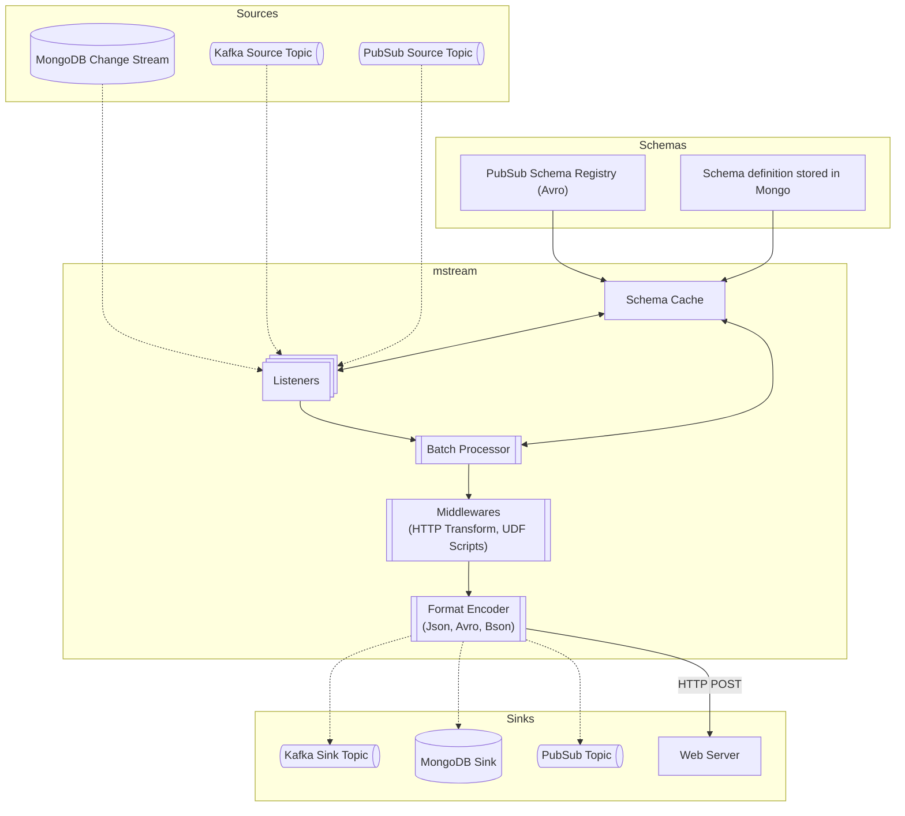
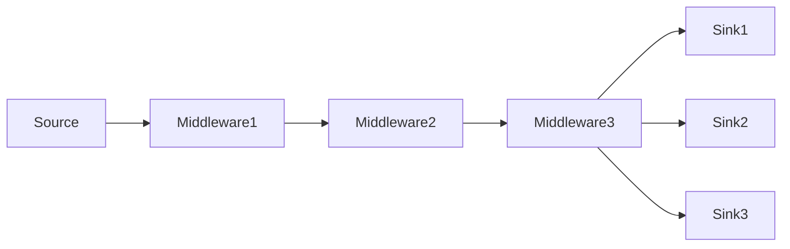

# mstream

A lightweight, configurable data streaming bridge that connects sources to sinks with powerful transformation capabilities.

## Overview

mstream creates connectors that move data between various systems with flexible transformation options:

1. **Source → Sink Streaming**: Connect data from [MongoDB change streams](https://www.mongodb.com/docs/manual/changeStreams/), Kafka, or PubSub to multiple destinations
2. **Format Conversion**: Seamlessly convert between BSON, JSON, and Avro formats
3. **Schema Filtering**: Apply schema-based field filtering to extract only needed data
4. **Transformation Pipeline**: Process data through configurable middleware chains before delivery
5. **Batch Processing**: Efficiently process events in batches for high-throughput scenarios

## Key Features

- **Multiple Destination Support**: Stream from one source to multiple sinks simultaneously
- **Middleware Processing**: Transform data through HTTP services or user-defined scripts before delivery
- **User-Defined Functions**: Execute custom Rhai scripts for complex data transformations
- **Schema Validation**: Use AVRO schemas to validate and filter document fields
- **Format Flexibility**: Convert between common data formats (BSON, JSON, Avro)
- **Batch Processing**: Collect and process multiple events as a batch for improved performance

## Supported Integrations

**Sources:**

- MongoDB Change Streams (v6.0+)
- Kafka topics
- Google Cloud PubSub topics

**Sinks:**

- MongoDB collections
- Kafka topics
- Google Cloud PubSub topics
- HTTP endpoints

Configuration is managed through a simple TOML file. See the [example configuration](./mstream-config.toml.example).

_Note: The production configuration file should be named `mstream-config.toml` and placed in the same directory as the binary._

### Components



### Schema and Encoding Support

mstream provides powerful schema filtering and format conversion capabilities to transform data as it flows through your pipeline.

#### Schema Filtering and Multiple Schema Support

Schemas in mstream serve two important purposes:
1. **Field Filtering**: Extract only the fields you need from source documents
2. **Format Validation**: Ensure data conforms to expected structures

Each connector can define multiple schemas that can be referenced by ID at different points in the pipeline:

```toml
[[connectors]]
enabled = true
name = "multi-schema-example"
# Define all schemas used in this connector
schemas = [
    { id = "basic_schema", service_name = "pubsub-example", resource = "projects/your-project/schemas/basic-user" },
    { id = "extended_schema", service_name = "mongodb-local", resource = "schema_collection" },
]
```

When a schema is applied to a document, only fields defined in the schema will be included in the output. For example:

**Schema definition:**
```json
{
  "type": "record",
  "name": "User",
  "fields": [{ "name": "name", "type": "string" }]
}
```

**Source document:**
```json
{
  "name": "John",
  "age": 30,
  "last_name": "Doe"
}
```

**Result after filtering:**
```json
{
  "name": "John"
}
```

#### Encoding and Format Conversion

mstream v0.16.0+ uses a clear input/output encoding model for data flow:

- **Input Encoding**: The format data is received in
- **Output Encoding**: The format data is transformed to before passing to the next step

Important rules:
- **Input encoding** is only required for Kafka and PubSub sources
- Each step in the pipeline automatically uses the previous step's **output_encoding** as its input
- Format conversions are explicitly defined by the input/output encoding pair at each step

```toml
[[connectors]]
enabled = true
name = "format-conversion-example"
# Source with explicit input and output encodings
# *mind that toml does not support new lines for [inline tables](https://toml.io/en/v1.0.0#inline-table)
source = { service_name = "kafka-local", resource = "raw_data", input_encoding = "json", output_encoding = "bson", schema_id = "raw_schema" }
```

#### Schema Inheritance

The `schema_id` field is optional in most cases and follows these rules:

1. **Avro encoding**: A schema reference is required whenever Avro encoding is used
2. **Schema inheritance**: If no schema_id is specified, the component will use the schema defined at the most recent previous step
3. **Source schema**: If a schema is defined at the source, it will be applied to all steps unless overridden

This allows for flexible pipelines where data can be filtered differently for different destinations:

```toml
[[connectors]]
enabled = true
name = "schema-inheritance-example"
# Define schemas
schemas = [
    { id = "base_schema", service_name = "pubsub-example", resource = "projects/your-project/schemas/base" },
    { id = "analytics_schema", service_name = "pubsub-example", resource = "projects/your-project/schemas/analytics" },
]

# Source uses base_schema
source = { service_name = "mongodb-local", resource = "users", output_encoding = "bson", schema_id = "base_schema" }

# Middlewares and sinks can override the schema
middlewares = [
    # Uses base_schema by inheritance (no schema_id specified)
    { service_name = "http-local", resource = "normalize", output_encoding = "json" },

    # Overrides with a different schema
    { service_name = "http-local", resource = "analyze", schema_id = "analytics_schema", output_encoding = "json" },
]

sinks = [
    # Uses analytics_schema from the last middleware
    { service_name = "kafka-local", resource = "analytics_topic", output_encoding = "json" },

    # Explicitly uses base_schema
    { service_name = "mongodb-local", resource = "users_copy", output_encoding = "bson", schema_id = "base_schema" },
]
```

#### Supported Format Conversions

mstream supports these format conversions throughout the pipeline:

| Source Format | Target Format | Notes                                       |
|---------------|---------------|---------------------------------------------|
| BSON          | BSON          | Direct passthrough                          |
| BSON          | JSON          | Serializes BSON to JSON                     |
| BSON          | Avro          | Requires schema_id with Avro schema         |
| JSON          | JSON          | Passthrough                                 |
| JSON          | BSON          | Parses JSON to BSON                         |
| JSON          | Avro          | Requires schema_id with Avro schema         |
| Avro          | Avro          | Validates against schema if provided        |
| Avro          | JSON          | Deserializes Avro to JSON                   |
| Avro          | BSON          | Converts Avro records to BSON documents     |
| Other         | Other         | Binary passthrough for custom formats       |

Conversions between "Other" encoding and structured formats (JSON/BSON/Avro) are not supported directly but can be implemented using middleware services.

### Batch Processing

mstream v0.17.0+ introduces batch processing capabilities for high-throughput scenarios, allowing you to collect and process multiple events as a single operation.

#### Benefits of Batch Processing

- **Improved Performance**: Reduced overhead by processing multiple events at once
- **Optimized I/O Operations**: Fewer network calls to sink systems
- **Better Resource Utilization**: More efficient use of system resources for high-volume data streams

#### Configuring Batch Processing

Batch processing is configured at the connector level using the `batch` parameter:

```toml
[[connectors]]
enabled = true
name = "high-throughput-connector"
# Configure batch processing with count-based batching
batch = { kind = "count", size = 100 }
source = { service_name = "mongodb-source", resource = "high_volume_collection", output_encoding = "bson" }
```

Current batch configuration options:

| Kind  | Parameters | Description                                    |
|-------|------------|------------------------------------------------|
| count | size       | Number of events to collect before processing  |

#### How Batch Processing Works

1. The connector collects events from the source until the batch criteria is met (e.g., batch size reached)
2. The entire batch is processed as a single unit through the pipeline (schema validation, middleware transformations)
3. The processed batch is delivered to all configured sinks

#### Batch Processing Data Structure

When batch processing is enabled, there are important considerations for how the data is structured:

1. **Middleware Processing**:
   - Batched events are sent to middleware services as an array of events in a single payload
   - Middleware services must be prepared to handle arrays rather than single events

2. **MongoDB Sink Format**:
   - For MongoDB sinks, batched events are stored as a document with an `items` property
   - The `items` property contains the array of individual events
   - Example of a stored batch document:
     ```json
     {
       "items": [
         { "id": 1, "name": "Event 1" },
         { "id": 2, "name": "Event 2" },
         { "id": 3, "name": "Event 3" }
       ]
     }
     ```

#### Batch Processing with Schemas and Middleware

Batch processing works seamlessly with existing schema validation and middleware transformations:

```toml
[[connectors]]
enabled = true
name = "batch-with-middleware"
batch = { kind = "count", size = 200 }
source = { service_name = "kafka-cloud", resource = "batch_events", input_encoding = "avro", output_encoding = "json", schema_id = "batch_schema" }
schemas = [
    { id = "batch_schema", service_name = "pubsub-example", resource = "projects/your-project/schemas/batch-events-schema" }
]
middlewares = [
    # Middleware receives the entire batch as an array
    { service_name = "transform-service", resource = "batch_process", schema_id = "batch_schema", output_encoding = "json" }
]
```

#### Batch Processing Considerations

- Middleware services must be capable of handling batched data (arrays) in the format provided
- Schema validation is applied to each event in the batch individually before passing to middleware
- The batch size directly affects memory usage and should be tuned based on available resources
- For time-sensitive events, lower batch sizes may be preferable to reduce latency

### Middleware Support

The mstream application supports middleware processing for data transformation before sending to sinks. This powerful feature allows you to modify, enrich, or transform data as it passes through the pipeline.

#### Middleware Functionality

Middleware components sit between the source and sink, allowing for data transformation or enrichment. Each middleware:

- Receives a source event with its payload
- Processes the data (via HTTP POST to external services)
- Returns a modified version of the event for further processing

Multiple middlewares can be chained together to create complex transformation pipelines.



#### Configuring Middlewares

In your connector configuration, you can specify one or more middlewares:

```toml
[[connectors]]
enabled = true
name = "employee-connector"
source = { service_name = "mongodb-local", resource = "employees", output_encoding = "bson" }
# Add middleware transformations
middlewares = [
    # resource = "transform" means that the middleware will execute a http post request to /transform endpoint
    { service_name = "http-local", resource = "transform", output_encoding = "json" },
    { service_name = "http-local", resource = "enrich", output_encoding = "json" },
]
sinks = [
    { service_name = "kafka-local", resource = "test", output_encoding = "json" },
    { service_name = "mongodb-local", resource = "employees-copy", output_encoding = "bson" },
]
```

#### HTTP Middleware

One type of middleware is HTTP, which:

1. Sends the event data to an external HTTP endpoint
2. Receives the transformed data as the response
3. Passes the transformed data to the next middleware or sink

Each middleware can specify its own encoding format, allowing for flexible transformation chains that convert between different data formats as needed.

#### UDF (User-Defined Function) Middleware

UDF middleware allows you to transform data using custom scripts written in the Rhai scripting language. This provides powerful data transformation capabilities while maintaining security through sandboxed execution.

**Features:**
- Safe, sandboxed script execution
- Resource limits (operations, memory, execution depth)
- Built-in JSON processing functions
- Binary data handling through base64 encoding

**Configuration:**
```toml
[[services]]
provider = "udf"
name = "udf-rhai"
engine = { kind = "rhai" }
script_path = "/my/script/path"

middlewares = [
    { service_name = "udf-rhai", resource = "json_transform.rhai", output_encoding = "json" },
]
```

**Script Requirements:**
Scripts must define a `transform` function with the signature:
```rhai
fn transform(input, attributes) {
    // Process data and return result
    result(transformed_data, updated_attributes)
}
```

**Examples:**
See the [examples/rhai](./examples/rhai) directory for complete script examples including JSON transformation, attribute enrichment, and data filtering.

#### Data Flow with Middleware

1. Source produces an event
2. Event optionally passes through schema filtering
3. Event sequentially passes through each configured middleware
4. The final transformed event is sent to all configured sinks

This middleware capability is especially useful for:

- Data enrichment from external services
- Complex transformations beyond simple field filtering
- Normalization of data across different sources
- Custom business logic implementation
- Encoding conversions that are not natively supported by mstream, i.e. **protobuf to json**

### Mongo Event Processing

**Supported Sources**

- [MongoDB Change Stream Events](https://www.mongodb.com/docs/v6.0/reference/change-events/)
  - Insert document
  - Update document
  - Delete document
- Kafka Messages

**The worker will report an error and stop execution for MongoDB events**

- Invalidate stream
- Drop collection
- Drop database

#### Message Structure

A processed change stream is transformed into a pubsub message with the following structure:

**[Attributes](https://cloud.google.com/pubsub/docs/publisher#using-attributes)**

| attribute name | attribute value                          |
| -------------- | ---------------------------------------- |
| operation_type | event type: `insert`, `update`, `delete` |
| database       | mongodb database name                    |
| collection     | mongodb collection name                  |

Attributes can be used to configure fine-grained subscriptions. For more details see [documentation](https://cloud.google.com/pubsub/docs/subscription-message-filter#filtering_syntax)

### Running

```sh
# Spawn mongo cluster in docker
$ make db-up
$ make db-check

# This will run the app with 'cargo run' and debug log level
$ make run-debug
```

### Testing

**Unit tests**

```sh
$ make unit-tests
```

**Integration tests** _(to be run locally)_

Install [gcloud](https://cloud.google.com/sdk/docs/install) - google access token will be retrieved through gcloud cli tool, unlike production case scenario where the application relies on service account configuration.

In order to run integration tests, it is required to have locally spawned mongodb cluster
and a configured GCP pubsub topic, schema and subscription.

It is planned to automate creating GCP resources in the future. For now check `tests/setup/mod.rs`

```sh
$ make integration-tests
```

### Configuring Docker Mongo Cluster

https://www.mongodb.com/compatibility/deploying-a-mongodb-cluster-with-docker

## License

License under either or:

- [MIT](LICENSE-MIT)
- [Apache License, Version 2.0](LICENSE-APACHE)
