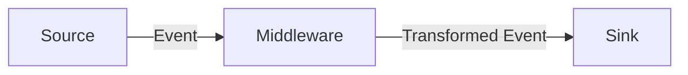

# mstream

[](https://codescene.io/projects/45886)

A lightweight, high-performance data streaming bridge that connects sources to sinks with powerful transformation capabilities.

**mstream** simplifies building data pipelines by providing a configurable bridge between systems like MongoDB, Kafka, and PubSub. It handles format conversion, schema validation, and data transformation out of the box.

## Web UI

Access the dashboard at `http://localhost:8719/`.


- **Dashboard** — Overview of all jobs and services
- **Job Management** — Create, stop, and restart jobs
- **Service Management** — View and manage service configurations
- **Pipeline Visualization** — Visual representation of data flow

## Features

- **Universal Connectivity** — Stream data between MongoDB, Kafka, and Google Cloud PubSub
- **Zero-Code Transformations** — Convert between BSON, JSON, and Avro formats automatically
- **Powerful Middleware** — Transform data in-flight using HTTP services or embedded Rhai scripts
- **Schema Validation** — Enforce data quality with Avro schema validation
- **Batch Processing** — Optimized high-throughput batch handling
- **Checkpoint Persistence** — Resume streaming from the last processed position after restarts

## Installation

### Using Docker (recommended)

```bash
cp mstream-config.toml.example mstream-config.toml
# edit config as needed
make docker-up
```

### Building from Source

```bash
cargo build --release
RUST_LOG=info ./target/release/mstream
```

## Quick Start

Create a `mstream-config.toml` file:

```toml
[[services]]
provider = "mongodb"
name = "mongo-local"
connection_string = "mongodb://localhost:27017"
db_name = "app_db"
write_mode = "insert"  # optional: "insert" (default) or "replace"

[[services]]
provider = "kafka"
name = "kafka-local"
"bootstrap.servers" = "localhost:9092"

[[connectors]]
enabled = true
name = "users-sync"
source = { service_name = "mongo-local", resource = "users", output_encoding = "json" }
sinks = [
    { service_name = "kafka-local", resource = "users-topic", output_encoding = "json" }
]
```

Run mstream:

```bash
RUST_LOG=info ./mstream
```

### Examples

- [mongo_to_kafka.toml](examples/mongo_to_kafka.toml) — MongoDB Change Stream → Kafka
- [kafka_to_mongo.toml](examples/kafka_to_mongo.toml) — Kafka → MongoDB
- [rhai/](examples/rhai) — Rhai transformation scripts (includes [append-only MongoDB pattern](examples/rhai/README.md#append-only-mongodb-sink))

## Core Concepts



- **Source** — Origin of data (MongoDB Change Stream, Kafka topic, PubSub subscription)
- **Middleware** — Optional transformation step (HTTP service or Rhai script)
- **Sink** — Destination for data (Kafka topic, MongoDB collection, PubSub topic, HTTP endpoint)

## Supported Integrations

| Type | Service | Notes |
|------|---------|-------|
| **Source** | MongoDB | Change Streams (v6.0+) |
| **Source** | Kafka | Consumer groups, offset management |
| **Source** | Google PubSub | Subscriptions |
| **Sink** | MongoDB | Insert or Replace (upsert by `_id`) |
| **Sink** | Kafka | Producer |
| **Sink** | Google PubSub | Publisher |
| **Sink** | HTTP | POST requests |

## Environment Variables

| Variable | Description | Default |
|----------|-------------|---------|
| `MSTREAM_API_PORT` | Port for the REST API and Web UI | `8719` |
| `MSTREAM_ENC_KEY` | Hex-encoded AES-256 key for service encryption | — |
| `RUST_LOG` | Log level (`error`, `warn`, `info`, `debug`, `trace`) | `info` |

## Management API

REST API available at port `8719` (configurable via `MSTREAM_API_PORT`).

### Jobs

| Method | Endpoint | Description |
|--------|----------|-------------|
| `GET` | `/jobs` | List all jobs |
| `POST` | `/jobs` | Create a new job |
| `POST` | `/jobs/{name}/stop` | Stop a job |
| `POST` | `/jobs/{name}/restart` | Restart a job |
| `GET` | `/jobs/{name}/checkpoints` | List checkpoint history for a job |

### Services

| Method | Endpoint | Description |
|--------|----------|-------------|
| `GET` | `/services` | List all services |
| `POST` | `/services` | Create a new service |
| `GET` | `/services/{name}` | Get service details |
| `DELETE` | `/services/{name}` | Remove a service (if not in use) |

## Checkpoints

Checkpoints allow connectors to resume from their last processed position after a restart, preventing data loss or reprocessing.

### System Configuration

Enable checkpoints globally by configuring a MongoDB backend:

```toml
[system.checkpoints]
service_name = "mongo-local"  # Must reference an existing MongoDB service
resource = "mstream-checkpoints"  # Collection to store checkpoint data
```

### Connector Configuration

Enable checkpointing per connector:

```toml
[[connectors]]
name = "users-sync"
checkpoint = { enabled = true }
source = { service_name = "mongo-local", resource = "users", output_encoding = "json" }
sinks = [
    { service_name = "kafka-local", resource = "users-topic", output_encoding = "json" }
]
```

### Supported Sources

| Source | Checkpoint Data | Notes |
|--------|-----------------|-------|
| MongoDB Change Stream | Resume token | Automatic resume on restart |
| Kafka | Topic, partition, offset | `offset_seek_back_seconds` takes priority over checkpoint when set |
| Google PubSub | — | Not yet supported |

### Behavior

- When a connector restarts with checkpoints enabled, it resumes from the last saved position
- For Kafka: if `offset_seek_back_seconds` is configured, it takes priority over the checkpoint (useful for reprocessing historical data)
- Checkpoints are saved after all sinks successfully process each event

## Documentation

- [Persistence](docs/persistence.md) — Job and service persistence configuration
- [Technical Reference](docs/reference.md) — Encoding, schemas, batch processing, middleware

## Development

```bash
make docker-db-up    # Start MongoDB cluster
make run-debug       # Run with debug logging
make unit-tests      # Run unit tests
make integration-tests  # Run integration tests
```

## License

MIT License — see [LICENSE](LICENSE) for details.
