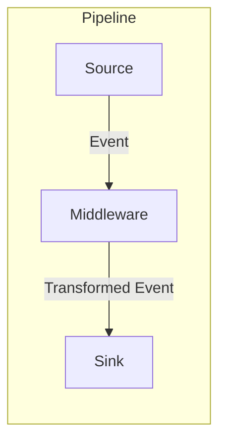

# mstream

A lightweight, high-performance data streaming bridge that connects sources to sinks with powerful transformation capabilities.

**mstream** simplifies building data pipelines by providing a configurable bridge between systems like MongoDB, Kafka, and PubSub. It handles format conversion, schema validation, and data transformation out of the box, allowing you to focus on your data logic rather than glue code.

## 🚀 Features

- **Universal Connectivity**: Stream data between MongoDB, Kafka, and Google Cloud PubSub.
- **Zero-Code Transformations**: Convert between BSON, JSON, and Avro formats automatically.
- **Powerful Middleware**: Transform data in-flight using HTTP services or embedded Rhai scripts.
- **Schema Validation**: Enforce data quality with Avro schema validation and filtering.
- **High Performance**: Optimized batch processing with zero-copy handling.
- **Simple Configuration**: Define your entire pipeline in a single TOML file.

## 📦 Installation

###  Get Help

```base
make
```

### Using Docker

1. Create a configuration file:
   ```bash
   cp mstream-config.toml.example mstream-config.toml
   ```

2. Start the full stack using the Makefile helper:
   ```bash
   make docker-up
   ```

### Building from Source

```bash
cargo build --release
```

## 🔧 Quick Start

Create a `mstream-config.toml` file to define your pipeline. Here is a simple example that streams changes from a MongoDB collection to a Kafka topic:

```toml
# 1. Define Services
[[services]]
provider = "mongodb"
name = "mongo-local"
connection_string = "mongodb://localhost:27017"
db_name = "app_db"

[[services]]
provider = "kafka"
name = "kafka-local"
"bootstrap.servers" = "localhost:9092"

# 2. Define Connector
[[connectors]]
enabled = true
name = "users-sync"

# Source: Watch 'users' collection
source = { service_name = "mongo-local", resource = "users", output_encoding = "json" }

# Sink: Publish to 'users-topic'
sinks = [
    { service_name = "kafka-local", resource = "users-topic", output_encoding = "json" }
]
```

Ready-made configs:
* [mongo_to_kafka.toml](examples/mongo_to_kafka.toml) (MongoDB → Kafka)
* [kafka_to_mongo.toml](examples/kafka_to_mongo.toml) (Kafka → MongoDB)

Run mstream with your configuration:

```bash
# All together
cargo build --release
cp target/release/mstream .
cp mstream-config.toml.example ./mstream-config.toml
# update the config as needed
RUST_LOG=info ./mstream

# Or run with Docker Compose (recommended)
cp mstream-config.toml.example ./mstream-config.toml
# update the config as needed
make docker-up
make db-init-rpl-set
```

## 🗄️ Job Lifecycle Persistence

mstream keeps job definitions and runtime state in an internal job-lifecycle store so that restarts are predictable. By default the store is in-memory, but you can opt into a persistent backend by pointing the system section at a managed service:

```toml
[system.job_lifecycle]
service_name = "mongodb-source"
resource = "job-lifecycle"
startup_state = "seed_from_file" # other options: "force_from_file", "keep"
```

- **service_name** references an existing service entry (e.g. MongoDB) that will host the lifecycle collection/table.
- **resource** is the database collection/table used to store job metadata.
- **startup_state** controls how jobs are reconciled when mstream boots:
  - `force_from_file`: stop everything and start only the connectors listed in the config file.
  - `seed_from_file`: initialize the store from the file if it is empty, otherwise resume the previously persisted state.
  - `keep`: ignore the file and resume whatever is already stored (handy for API-driven workflows).

With a persistent store in place you can safely restart the server without losing job intent, resume jobs automatically, or keep them paused until you explicitly restart them via the API. If you omit `[system.job_lifecycle]`, mstream falls back to its in-memory job store.

## 🔐 Service Registry Persistence

Services created through the config file or the `/services` API can survive restarts by enabling a persistent service registry. Point the registry at a MongoDB service and tell mstream where to read the encryption key that protects the stored definitions:

```toml
[system]
# Optional: override where the AES-256 key is stored; defaults to ./mstream.key
encryption_key_path = "./mstream-services.key"

[system.service_lifecycle]
service_name = "mongodb-source"
resource = "mstream-services"
```

- **service_name** must reference an existing MongoDB service; mstream reuses the same client and database.
- **resource** is the collection that will hold the encrypted service documents.
- **encryption_key_path** is the 32-byte AES-256 key file. If it is missing, mstream will generate it with strict file permissions; back it up because it is required to decrypt persisted services.
- Instead of storing the key on disk you can set the `MSTREAM_ENC_KEY` environment variable to the hex-encoded key (handy for container secrets managers).

If you skip `[system.service_lifecycle]`, service definitions remain in-memory and will be rebuilt from the config file on each restart.

With `service_lifecycle` configured, service definitions that are registered via config or API calls are written to MongoDB, restored on startup, and stay available to jobs even if the process restarts.

## 📚 Core Concepts

### Components



- **Source**: The origin of data (e.g., a MongoDB Change Stream, Kafka topic).
- **Sink**: The destination for data (e.g., a Kafka topic, HTTP endpoint).
- **Middleware**: Optional processing steps that sit between source and sink to transform, enrich, or filter data.

### Schema and Encoding

mstream uses a clear input/output encoding model:

- **Input Encoding**: The format data is received in (e.g., `avro` from Kafka).
- **Output Encoding**: The format data is transformed to before the next step (e.g., `json` for a sink).

```toml
[[connectors]]
# Read Avro from Kafka -> Convert to JSON -> Write to MongoDB as BSON
source = { service_name = "kafka", resource = "events", input_encoding = "avro", output_encoding = "json" }
sinks = [
    { service_name = "mongo", resource = "events_archive", output_encoding = "bson" }
]
```

### Batch Processing

For high-throughput scenarios, enable batch processing to group events:

```toml
[[connectors]]
name = "high-volume-sync"
batch = { kind = "count", size = 100 }
source = { service_name = "mongo", resource = "logs", output_encoding = "bson" }
sinks = [
    { service_name = "kafka", resource = "logs-batch", output_encoding = "json" }
]
```

**Important Considerations:**
- **MongoDB Requirements**: When using batching with a MongoDB sink, the output encoding must be set to `bson` to enable optimized bulk writes.
- **General Batching**: Batching is supported for all sinks. For non-MongoDB sinks (Kafka, PubSub), the batch is typically emitted as an array of events in the configured output encoding (e.g., JSON array).
- **Middleware**: Middleware services must be capable of handling batched data (arrays) in the format provided.
- **Schema Validation**: Schema validation is applied to each event in the batch individually before passing over.
- **Resource Usage**: The batch size directly affects memory usage and should be tuned based on available resources.
- **Latency**: For time-sensitive events, lower batch sizes may be preferable to reduce latency.

### Middleware Support

Transform data on the fly using HTTP services or embedded scripts.

#### HTTP Middleware
Send events to an external API for processing:

```toml
middlewares = [
    { service_name = "my-api", resource = "enrich-user", output_encoding = "json" }
]
```

#### UDF (Rhai) Middleware
Write custom transformation logic in [Rhai](https://rhai.rs) scripts for high-performance, safe execution:

```toml
[[services]]
provider = "udf"
name = "script-engine"
engine = { kind = "rhai" }
script_path = "./scripts"

[[connectors]]
middlewares = [
    { service_name = "script-engine", resource = "anonymize.rhai", output_encoding = "json" }
]
```

**Example Script (`anonymize.rhai`):**
```rhai
fn transform(data, attributes) {
    // Mask email address
    if "email" in data {
        data.email = mask_email(data.email);
    }
    
    // Add timestamp
    data.processed_at = timestamp_ms();
    
    result(data, attributes)
}
```

## Supported Integrations

| Type | Service | Notes |
|------|---------|-------|
| **Source** | MongoDB | Change Streams (v6.0+) |
| **Source** | Kafka | Consumer groups, offset management |
| **Source** | Google PubSub | Subscriptions |
| **Sink** | MongoDB | Insert/Update/Delete operations |
| **Sink** | Kafka | Producer |
| **Sink** | Google PubSub | Publisher |
| **Sink** | HTTP | POST requests |

## Management API

mstream exposes a REST API for monitoring and management (default port: `8787`).

### Job Management

- `GET /jobs`: List all jobs along with their desired and current state.
- `POST /jobs`: Start a new job by providing a connector configuration.
- `POST /jobs/{name}/restart`: Restart an existing job using its stored pipeline definition.
- `POST /jobs/{name}/stop`: Stop a running job (the configuration remains stored for future use).

### List Services
- `GET /services`: List all configured services and their usage
- `POST /services`: Add a new service
- `DELETE /services/{name}`: Remove a service (if not in use)

**Service List Response Example:**
```json
[
  {
    "provider": "mongodb",
    "name": "etl-test-data",
    "connection_string": "*****",
    "db_name": "etl-tests",
    "used_by_jobs": [
      "integration-test"
    ]
  },
  {
    "provider": "kafka",
    "name": "kafka-prod",
    "bootstrap.servers": "kafka:9092",
    "sasl.password": "*****",
    "used_by_jobs": []
  }
]
```

## Technical Reference

### PubSub Message Structure

When using Google Cloud PubSub as a sink, mstream adds the following attributes to the message:

| Attribute | Description |
|-----------|-------------|
| `operation_type` | Event type: `insert`, `update`, `delete` |
| `database` | MongoDB database name (for Mongo sources) |
| `collection` | MongoDB collection name (for Mongo sources) |

### MongoDB Batch Format

When batch processing is enabled for a MongoDB sink, events are stored as a single document with an `items` array:

```json
{
  "items": [
    { "id": 1, "name": "Event 1" },
    { "id": 2, "name": "Event 2" }
  ]
}
```

### Schema Inheritance Rules

The `schema_id` field is optional in most cases and follows these rules:

1. **Avro encoding**: A schema reference is required whenever Avro encoding is used.
2. **Schema inheritance**: If no `schema_id` is specified, the component will use the schema defined at the most recent previous step.
3. **Source schema**: If a schema is defined at the source, it will be applied to all steps unless overridden.

### Format Conversion Matrix

| Source Format | Target Format | Notes |
|---------------|---------------|-------|
| BSON | BSON | Direct passthrough |
| BSON | JSON | Serializes BSON to JSON |
| BSON | Avro | Requires `schema_id` with Avro schema |
| JSON | JSON | Passthrough |
| JSON | BSON | Parses JSON to BSON |
| JSON | Avro | Requires `schema_id` with Avro schema |
| Avro | Avro | Validates against schema if provided |
| Avro | JSON | Deserializes Avro to JSON |
| Avro | BSON | Converts Avro records to BSON documents |

### Development Commands

```bash
# Spawn mongo cluster in docker
make docker-db-up
make db-check

# Run the app with debug logging
make run-debug

# Run unit tests
make unit-tests

# Run integration tests (requires local mongo and GCP setup)
make integration-tests
```

## License

This project is licensed under the MIT License - see the [LICENSE](LICENSE) file for details.
